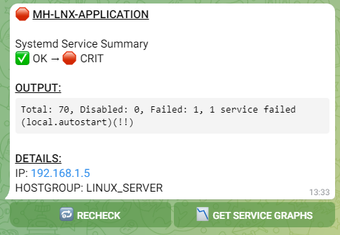
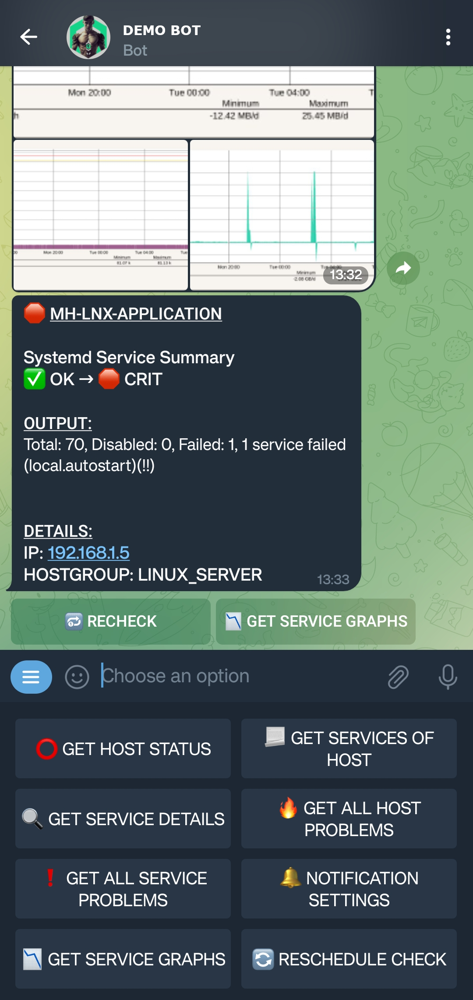
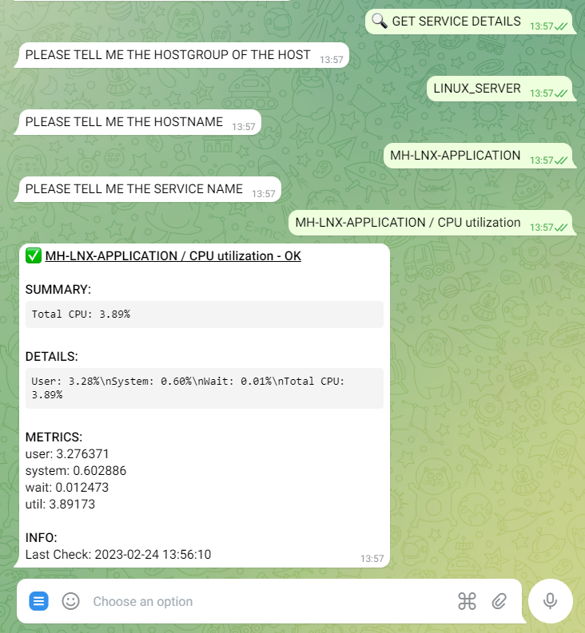
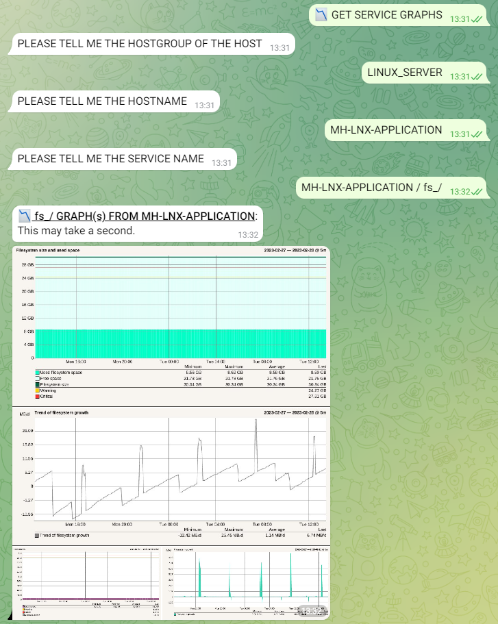
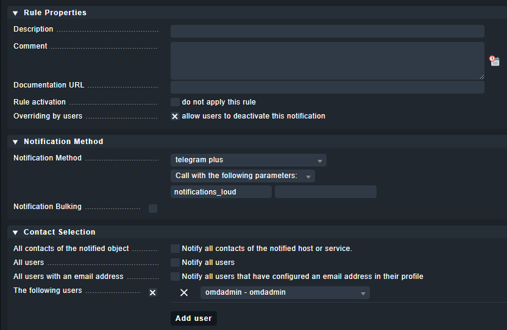
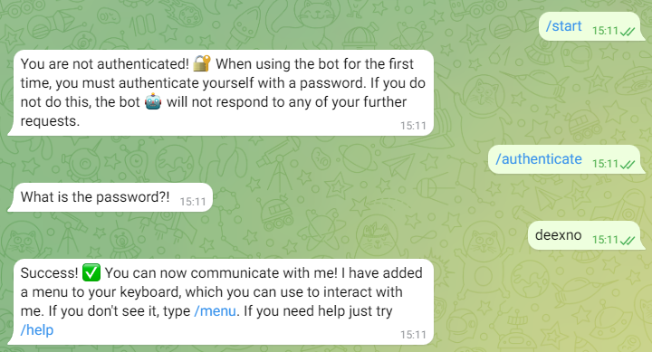
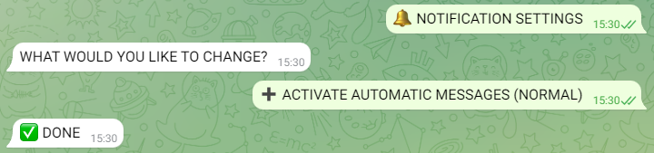

This Telegram bot provides an interface to your Check_MK server. It allows you to send automatic error messages (alerts) via Telegram and to manually read out information about hosts and services.

# Examples
</img> </img> </img> </img>

# Info
This bot is NOT meant to be used in groups. 

# The Installation / Update process
1. Install the bot. <br>
Replace the variables in <> with your respective information.<br>
- omd_site_name (Your OMD Check_MK site which you want to monitor)
- api_token (You get this token from the BotFather of Telegram)
- bot_password (This can be a password of your choice, which will be used later to authenticate to the bot)
```bash
wget https://raw.githubusercontent.com/deexno/checkmk-telegram-plus/main/install.sh
bash install.sh <omd_site_name> <api_token> <bot_password>
```

2. Create a rule that exports the notifications using our new Notification Plugin.

For your information, you can use the first parameter to determine whether a notification should be sent loud (notifications_loud) or silent (notifications_silent). Silent notifications pop up in the chat, but the device does not vibrate or make a notification sound. This method can be used, for example, to differentiate between important and unimportant notifications.

# Usage
### Authenticate
By default, the bot doesn't allow any communication until you authenticate with the previously set password in the configuration file. Here's an example:
<br>

### Receive information about hosts and services
Retrieving data manually is easy. After authentication, you should see a new icon next to the keyboard – the menu button. Open the menu and select an option. The bot will ask for necessary info and provide results (as seen in the examples).

### Enable and disable notifications
You can enable or disable messages through the bot. "Loud" and "silent" notifications can also be toggled independently. Note that this setting is ONLY FOR YOU, and all other users will still receive their notifications as normal.
<br>
