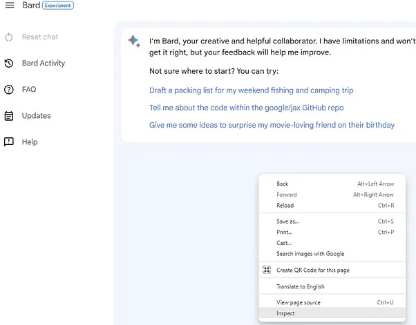
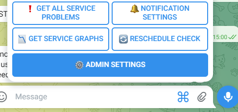
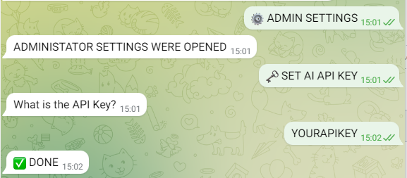
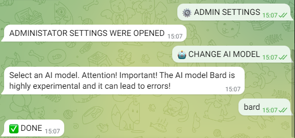
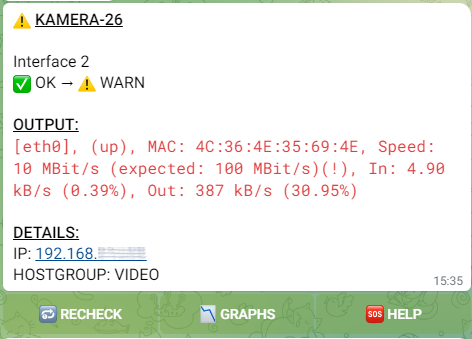
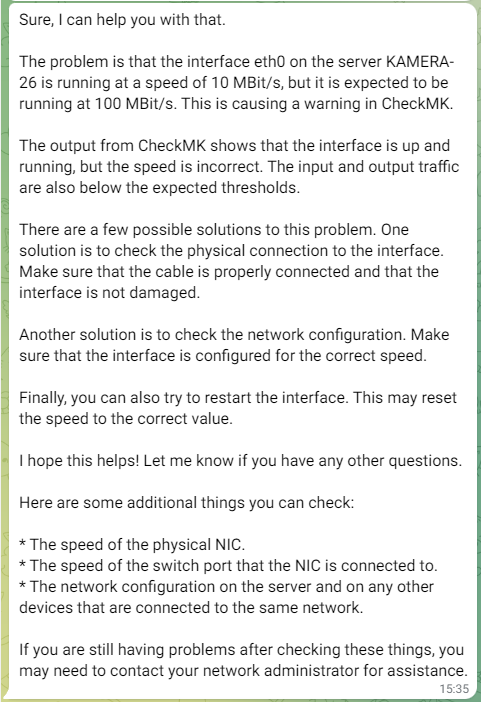
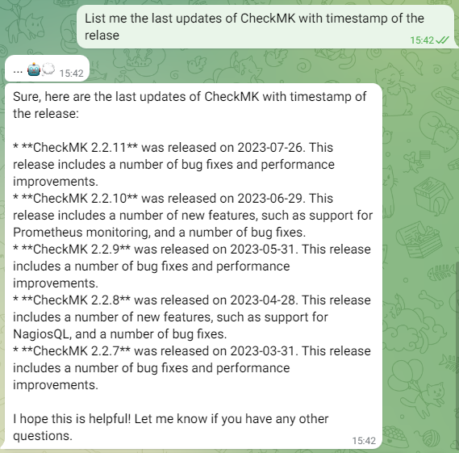
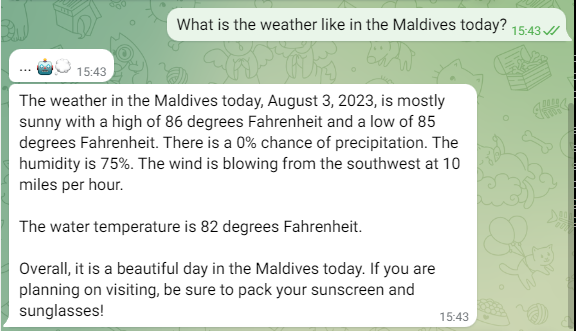

This Telegram bot provides an interface to your Check_MK server. It allows you to send automatic error messages (alerts) via Telegram and to manually read out information about hosts and services.

<hr>

- [Examples](#examples)
- [Info](#info)
- [The Installation / Update process](#the-installation--update-process)
- [Uninstall the Bot](#uninstall-the-bot)
- [Usage](#usage)
    - [Authenticate](#authenticate)
    - [Receive information about hosts and services](#receive-information-about-hosts-and-services)
    - [Enable and disable notifications](#enable-and-disable-notifications)
    - [Activation of the AI function (EXPERIMENTAL)](#activation-of-the-ai-function-experimental)
- [Using the AI](#using-the-ai)
    - [The help for automatic notifications](#the-help-for-automatic-notifications)
    - [The Chat](#the-chat)
- [Troubleshooting Guide](#troubleshooting-guide)
- [Support my work](#support-my-work)

<hr>

# Examples
</img> </img> </img> </img>

# Info
This bot is NOT meant to be used in groups.

# The Installation / Update process
1. Install the bot. <br>
Replace the variables in <> with your respective information.<br>
- omd_site_name (Your OMD Check_MK site which you want to monitor)
- api_token (You get this token from the BotFather of Telegram)
- bot_password (This can be a password of your choice, which will be used later to authenticate to the bot)
```bash
wget https://raw.githubusercontent.com/deexno/checkmk-telegram-plus/main/install.sh
bash install.sh <omd_site_name> <api_token> <bot_password>
```

2. Create a rule that exports the notifications using our new Notification Plugin.

For your information, you can use the first parameter to determine whether a notification should be sent loud (notifications_loud) or silent (notifications_silent). Silent notifications pop up in the chat, but the device does not vibrate or make a notification sound. This method can be used, for example, to differentiate between important and unimportant notifications.<br><br>

**To update the bot, simply download the install.sh file again as mentioned above and run it with the 3 required arguments**

# Uninstall the Bot
1. Stop the bot
```bash
omd_site_name=<omd_site_name>
systemctl stop checkmk-telegram-plus-$omd_site_name
rm /etc/systemd/system/checkmk-telegram-plus-$omd_site_name.service
systemctl daemon-reload
```

2. Delete all notification rules you have created regarding this bot (as described in step 2 of the installation).

3. Clean and remove all data concerning the bot
```bash
rm -Rf /omd/sites/$omd_site_name/local/share/check_mk/notifications/telegram_plus_notify_listener
rm -Rf /omd/sites/$omd_site_name/local/share/checkmk-telegram-plus
```

# Usage
### Authenticate
By default, the bot doesn't allow any communication until you authenticate with the previously set password in the configuration file. Here's an example:
<br>

### Receive information about hosts and services
Retrieving data manually is easy. After authentication, you should see a new icon next to the keyboard – the menu button. Open the menu and select an option. The bot will ask for necessary info and provide results (as seen in the examples).

### Enable and disable notifications
You can enable or disable messages through the bot. "Loud" and "silent" notifications can also be toggled independently. Note that this setting is ONLY FOR YOU, and all other users will still receive their notifications as normal. **And they are decativated by default! So don't forget to activate them!**
<br>

### Activation of the AI function (EXPERIMENTAL)
The bot now has an integrated AI since version 3.0.0. This is currently **still expertimentell**. It should help with problems and give support. Currently, only Bard is supported as an AI model, since no costs are currently incurred. It is planned to support the API of OPENAI in the future, should Bard not work anymore.

To authenticate, it is essential to make use of your __Secure-1PSID value, which can be found within the cookies while navigating through Bard.

It is worth mentioning that while the __Secure-1PSID is often colloquially referred to as an API KEY for ease of understanding, it does not hold an official designation as such. Furthermore, it is of utmost importance to safeguard your value and refrain from sharing it to maintain the security of your access.

1. Visit https://bard.google.com/
2. Press F12 or right-click and "Inspect":

3. Navigate to `Application` → `Cookies` → and copy the value of your `__Secure-1PSID` cookie:


4. Open the Telegram bot and navigate to `ADMIN SETTINGS` → `SET AI API KEY`.  For this step, the **bot must already be installed and running**.


5. Once you have done that, the bot will ask you for an API key. Send the bot the content of the __Secure-1PSID cookie value you received earlier.


6. navigate to `ADMIN SETTINGS` → `🤖 CHANGE AI MODEL` and then select bard as your AI model to guarantee the correct use of the model


# Using the AI
The AI currently has 2 functions. If any suggestions are made, this can be expanded.

Keep in mind that the AI is currently still highly experimental and I cannot guarantee its output. It is currently intended to be used to gain experience.

In the future, it should be a personal assistant who helps with problems. It should also be possible in the future to fill it with data to give personalized output. This could be especially useful for on-call staff who may not always know every system perfectly.

### The help for automatic notifications
After upgrading to version 3.0.0 or later, each Automatic Message has an additional button. The `HELP` button. When this button is pressed, the AI gives a summary of how the problem probably arose and what you can do to possibly solve it. Depending on the service output, these suggestions from the AI can be better or worse.<br>
</img><br>
</img>

### The Chat
The bot also has the default AI functions you may know from ChatGPT. You can ask him questions about CheckMK and IT problems, but you can also use him for other things.<br>
</img><br>
</img>

# Troubleshooting Guide
<b><a href="TROUBLESHOOTING.md">TROUBLESHOOTING GUIDE 🔨</a></b>

# Support my work
<a href="https://www.buymeacoffee.com/deexno" target="_blank"></a>
<a href="https://www.paypal.com/paypalme/deexno" target="_blank"></a>
