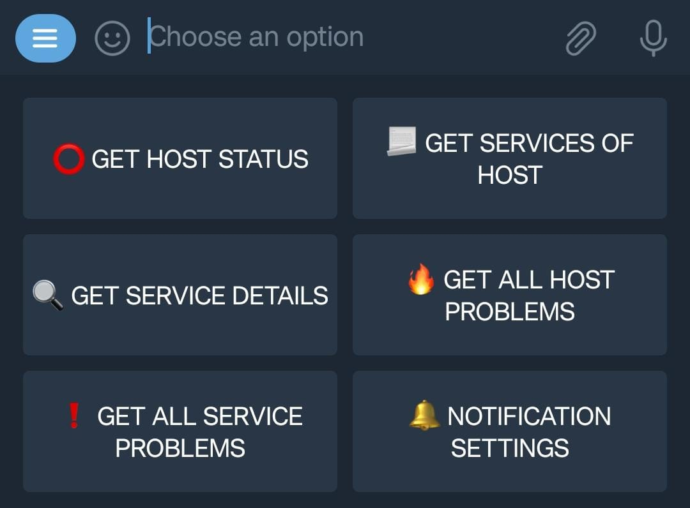

This Telegram bot provides an interface to your CheckMK server. It allows you to send automatic error messages (alerts) via Telegram and to manually read out information about hosts and services.

# Examples




# Info
This bot is not meant to be used in groups. it is meant to be used face to face. 

# The Installation
1. Install the required Python libraries
```bash
pip install python-telegram-bot python-telegram-bot[job-queue] python-telegram-bot[callback-data] watchdog
```

2. Download the content of this Git repository to your server
```bash
git clone https://github.com/deexno/checkmk-telegram-plus.git .
cd checkmk-telegram-plus
```

3. Copy all components of the telegram bot into a path of your choice. For example, under /opt/checkmk-telegram-plus/
```bash
mkdir /opt/checkmk-telegram-plus/
cp telegram_bot.py config.ini /opt/checkmk-telegram-plus/
```

4. Fill in the following info in the configuration file: 
- api_token (You get this token from the <a href="https://www.siteguarding.com/en/how-to-get-telegram-bot-api-token">BotFather</a> of Telegram)
- password_for_authentication (This can be a password of your choice, which will be used later to authenticate to the bot)
- site (Your OMD CheckMK site which you want to monitor)

```bash
nano /opt/checkmk-telegram-plus/config.ini
```

5. Create a service that always runs the bot at system startup.
```bash
cp checkmk-telegram-plus.service /etc/systemd/system/
systemctl daemon-reload
systemctl enable --now checkmk-telegram-plus
systemctl status checkmk-telegram-plus
```

6. Copy the Notify Script into the CheckMK directory so that we can later create notificationrules which use our plugin.
```bash
omd_site=<YOUR OMD SITENAME>
cp telegram_plus_notify_listener /omd/sites/$omd_site/local/share/check_mk/notifications/
chmod +x /omd/sites/$omd_site/local/share/check_mk/notifications/telegram_plus_notify_listener
```

7. Create a rule that exports the notifications with our new Notification Plugin.


# Usage
### Authenticate


### Receive informations about hosts and services 

### Enable and disable notifications
