This Telegram bot provides an interface to your Check_MK server. It allows you to send automatic error messages (alerts) via Telegram and to manually read out information about hosts and services.

<hr>

- [Examples](#examples)
- [Info](#info)
- [System recommendations](#system-recommendations)
- [The Installation / Update process](#the-installation--update-process)
- [Uninstall the Bot](#uninstall-the-bot)
- [Usage](#usage)
    - [Authenticate](#authenticate)
    - [Receive information about hosts and services](#receive-information-about-hosts-and-services)
    - [Enable and disable notifications](#enable-and-disable-notifications)
- [Activation of the AI function](#activation-of-the-ai-function)
- [Using the AI](#using-the-ai)
- [Troubleshooting Guide](#troubleshooting-guide)
- [Support my work](#support-my-work)

<hr>

# Examples
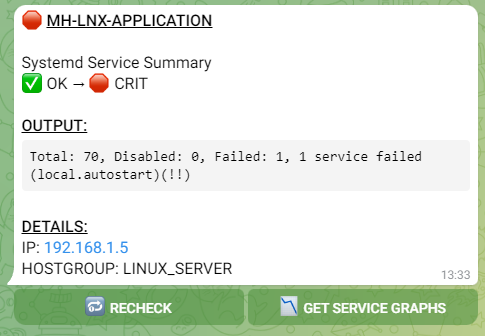</img> 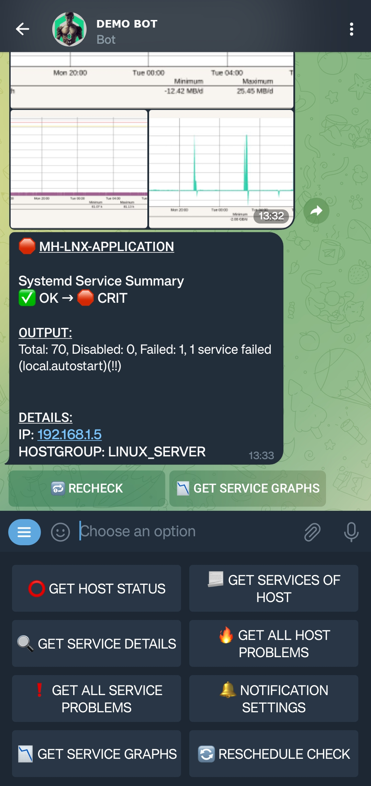</img> 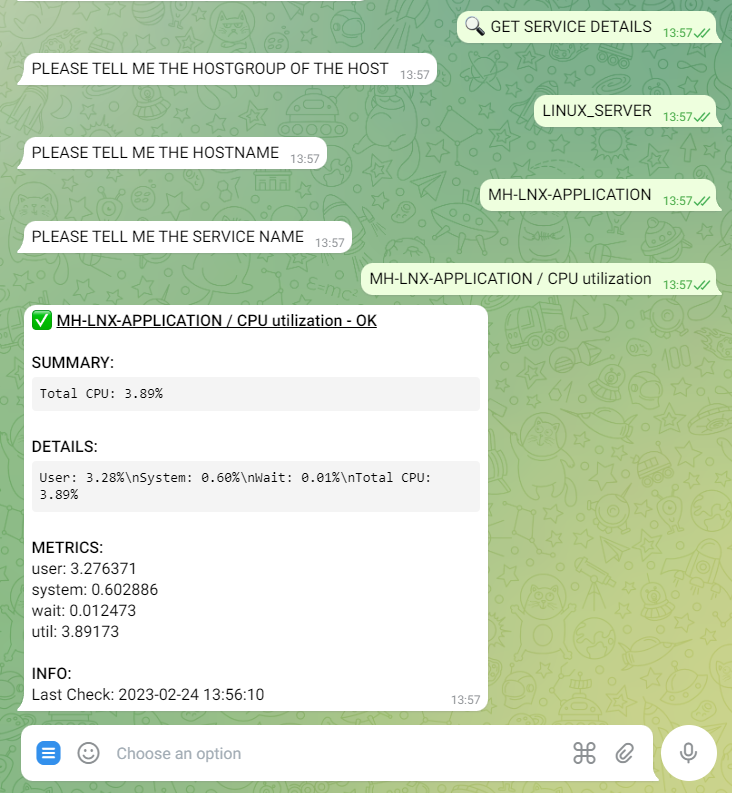</img> 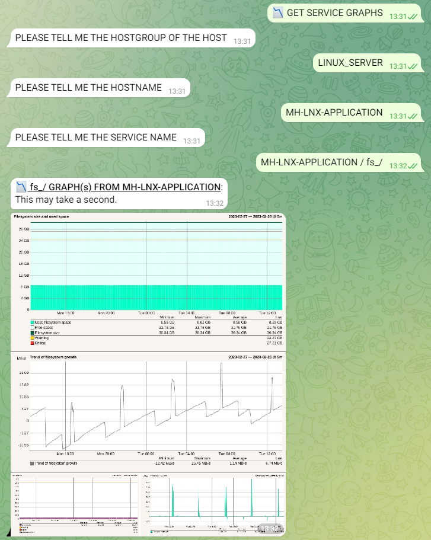</img>

# Info
This bot is NOT meant to be used in groups.

# System recommendations
- CheckMK Version 2.1.p25 or higher
- The programs curl, python3, pip3, tar, mktemp, runuser, sed & systemctl installed on the server

# The Installation / Update process
1. Install the bot. The installer fetches the 3 latest GitHub Releases and asks which version should be installed. It also offers a `main` branch option for testing only. <br>
The installer reviews the configuration interactively. Existing values in `/etc/checkmk-telegram-plus/<omd_site_name>.ini` are preserved when you press Enter. Secrets are only shown as configured, never printed in clear text. Missing required values such as the Telegram BotFather token and bot password are requested before the service is installed.

The installer uses a split architecture. Only a minimal notification adapter is installed into the CheckMK site. The application, virtual environment and third-party Python dependencies are installed outside CheckMK:

```text
/opt/checkmk-telegram-plus/app
/opt/checkmk-telegram-plus/venv
/etc/checkmk-telegram-plus/<omd_site_name>.ini
/var/lib/checkmk-telegram-plus/<omd_site_name>
/var/log/checkmk-telegram-plus
/run/checkmk-telegram-plus/<omd_site_name>.sock
/run/checkmk-telegram-plus/<omd_site_name>-bridge.sock
```

The external app runs as the dedicated `checkmk-telegram-plus` system user. A small CheckMK bridge runs as the CheckMK site user and exposes only typed local operations for Livestatus, graphs, `cmk --check`, OMD status/start/stop and acknowledgements.

For service graphs on newer CheckMK versions, configure the optional CheckMK Web graph export settings during installation, or edit them later in:

```bash
omd_site_name=<omd_site_name>
nano /etc/checkmk-telegram-plus/$omd_site_name.ini
```

```ini
[checkmk_web]
base_url = http://127.0.0.1/<omd_site_name>
automation_user = automation
automation_secret = YOUR_AUTOMATION_SECRET
graph_count = 3
```

The local `http://127.0.0.1/<omd_site_name>` URL is recommended for the graph export. The bot first tries CheckMK's legacy internal graph renderer. If that renderer is not available, it uses the CheckMK Web `graph_image.py` PNG export endpoint with the automation credentials above. If a loopback HTTPS URL fails because the certificate is not valid for `127.0.0.1` or `localhost`, the bridge retries the same local request over HTTP. Missing graph support will not stop the bot or bridge service.

Existing installations are migrated automatically. Legacy configuration files are backed up before changes are made, and old site-local application files are moved to a `legacy-<timestamp>` directory below `/omd/sites/<omd_site_name>/local/share/checkmk-telegram-plus`.

Recommended one-line installation command:
```bash
curl -fsSL https://raw.githubusercontent.com/deexno/checkmk-telegram-plus/refs/heads/main/install.sh | sudo bash
```

If you are already logged in as root, run the same command without `sudo`.

Optional preseeded installation:
```bash
curl -fsSL https://raw.githubusercontent.com/deexno/checkmk-telegram-plus/refs/heads/main/install.sh | sudo bash -s -- <omd_site_name> <api_token> <bot_password>
```
The installer still opens the configuration review so upgrades can keep or correct existing values safely.

2. Create a rule that exports the notifications using our new Notification Plugin.
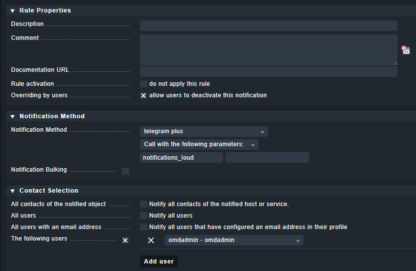
For your information, you can use the first parameter to determine whether a notification should be sent loud (notifications_loud) or silent (notifications_silent). Silent notifications pop up in the chat, but the device does not vibrate or make a notification sound. This method can be used, for example, to differentiate between important and unimportant notifications.<br><br>

**To update the bot, run the installation command again and choose the release version you want to install.**

# Uninstall the Bot
1. Stop the bot
```bash
omd_site_name=<omd_site_name>
systemctl stop checkmk-telegram-plus-$omd_site_name
rm /etc/systemd/system/checkmk-telegram-plus-$omd_site_name.service
systemctl daemon-reload
```

2. Delete all notification rules you have created regarding this bot (as described in step 2 of the installation).

3. Clean and remove all data concerning the bot
```bash
rm -Rf /omd/sites/$omd_site_name/local/share/check_mk/notifications/telegram_plus_notify_listener
rm -Rf /omd/sites/$omd_site_name/local/share/checkmk-telegram-plus
rm -Rf /etc/checkmk-telegram-plus/$omd_site_name.ini
rm -Rf /var/lib/checkmk-telegram-plus/$omd_site_name
rm -Rf /var/log/checkmk-telegram-plus
# Remove /opt/checkmk-telegram-plus only if no other CheckMK site uses this bot.
```

# Usage
### Authenticate
By default, the bot doesn't allow any communication until you authenticate with the previously set password in the configuration file. Here's an example:
<br>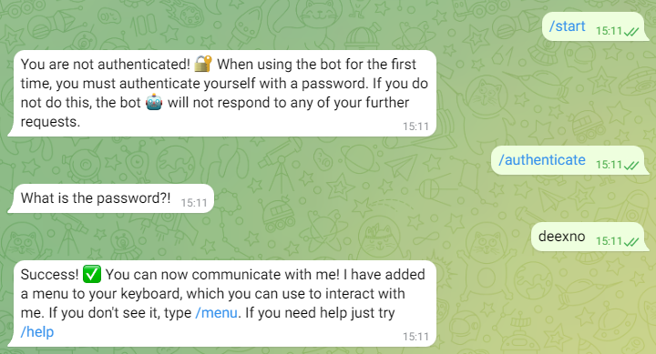

### Receive information about hosts and services
Retrieving data manually is easy. After authentication, you should see a new icon next to the keyboard – the menu button. Open the menu and select an option. The bot will ask for necessary info and provide results (as seen in the examples).

### Enable and disable notifications
You can enable or disable messages through the bot. "Loud" and "silent" notifications can also be toggled independently. Note that this setting is ONLY FOR YOU, and all other users will still receive their notifications as normal. **And they are decativated by default! So don't forget to activate them!**
<br>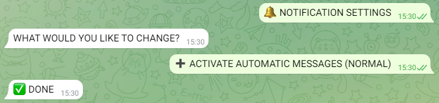

### Activate the admin settings ONLY for certain users
If you only want to activate the admin settings ONLY for certain users, follow these steps:
1. Open the config file of the bot
```
omd_site_name=<omd_site_name>
nano /etc/checkmk-telegram-plus/$omd_site_name.ini
```
2. If the option ‘admin_users’ does not yet exist in the config file, create it under the [telegram_bot] tab:
```
[telegram_bot]
...
allowed_users = XXX
admin_users =
notifications_loud = XXX
...
```
3. Whitelist all users for whom you want to activate the admin option by listing their user ID under admin_users. You will find the ID of the respective users under allowed_users once they have verified themselves at the Telegram bot
```
# Example Config
[telegram_bot]
...
allowed_users = deexno (987654321),adminuser2 (123456789),ViewUser0 (000000000),
admin_users = deexno (987654321),adminuser2 (123456789),
notifications_loud = XXX
```
4. Restart the Bot
```
systemctl restart checkmk-telegram-plus-$omd_site_name.service
```

### Activation of the AI function
1. Open the configfile
```bash
omd_site_name=<omd_site_name>
nano /etc/checkmk-telegram-plus/$omd_site_name.ini
```

2. Store your API key from openai under ‘token’. Your config file should then look like this:
```
[telegram_bot]
language = en
version = v3.2.0
api_token = XXXXXXXXXXXXXX
password_for_authentication = XXXXXXXXXXXXXX
allowed_users = XXXXXXXXXXXXXX
admin_users = XXXXXXXXXXXXXX
notifications_loud = XXXXXXXXXXXXXX
notifications_silent = XXXXXXXXXXXXXX

[check_mk]
site = XXXXXXXXXXXXXX

[openai]
model = gpt-4o-mini
token = YOUR-TOKEN
```

3. Restart the server
```bash
telegram_plus_service_name=checkmk-telegram-plus-$omd_site_name.service
systemctl restart $telegram_plus_service_name
```

Info: API keys can be created at https://platform.openai.com/api-keys after you have created an account at openai and topped up credit

# Using the AI
The AI currently has 2 functions. If any suggestions are made, this can be expanded.

Keep in mind that the AI is currently still highly experimental and I cannot guarantee its output. It is currently intended to be used to gain experience.

In the future, it should be a personal assistant who helps with problems. It should also be possible in the future to fill it with data to give personalized output. This could be especially useful for on-call staff who may not always know every system perfectly.

### The help for automatic notifications
After upgrading to version 3.0.0 or later, each Automatic Message has an additional button. The `HELP` button. When this button is pressed, the AI gives a summary of how the problem probably arose and what you can do to possibly solve it. Depending on the service output, these suggestions from the AI can be better or worse.<br>
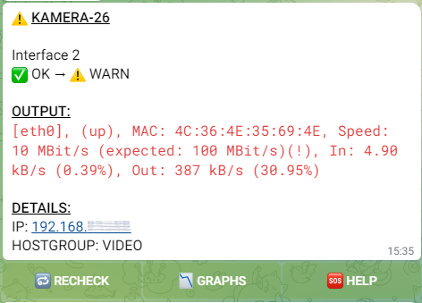</img><br>
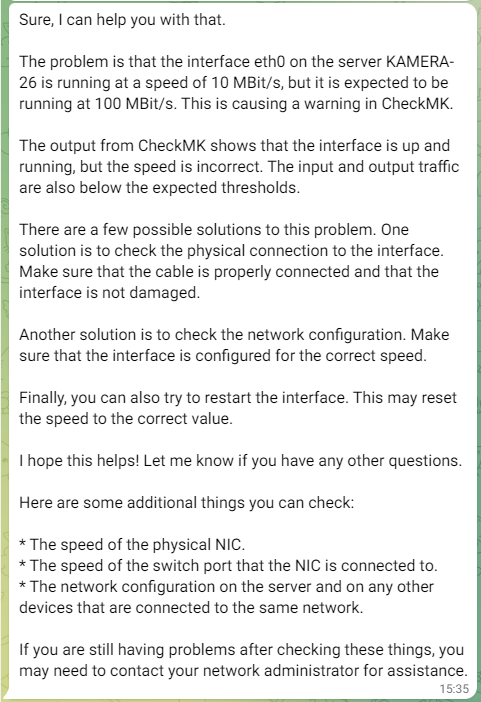</img>

### The Chat
The bot also has the default AI functions you may know from ChatGPT. You can ask him questions about CheckMK and IT problems, but you can also use him for other things.<br>
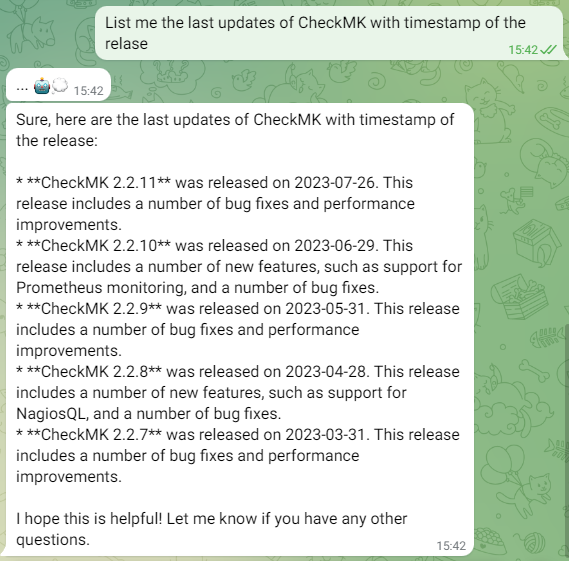</img><br>
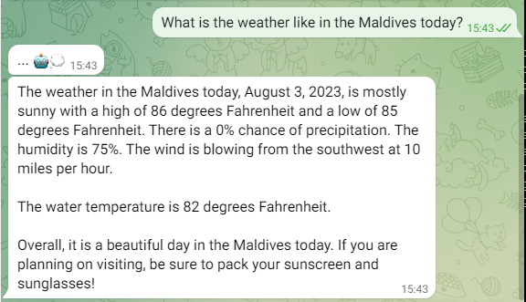</img>

# Troubleshooting Guide
<b><a href="TROUBLESHOOTING.md">TROUBLESHOOTING GUIDE 🔨</a></b>

# Mentions and articles about the bot
[TUTONAUT](https://www.tutonaut.de/checkmk-x-telegram-benachrichtigungen-status-spass/)<br>
[DEVINSIDER](https://www.dev-insider.de/kundenservice-verbesserung-mit-chatbots-ki-a-2ccfbe16571dd9071bdb096199ea82b7/)

# Support my work
<a href="https://www.buymeacoffee.com/deexno" target="_blank"></a>
<a href="https://www.paypal.com/paypalme/deexno" target="_blank"></a>

# Personalized AI Chatbots

In addition to the features described here, we now also develop personalized AI chatbots tailored to your specific needs. These custom solutions enable more precise and context-aware assistance—perfect for support, monitoring, or other specialized use cases.
Learn more and explore example projects on our website: [https://www.dexdot.it/](https://www.dexdot.it/chatbots-kundenservice-automatisieren-suedtirol/)
