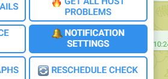
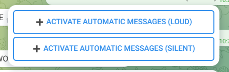
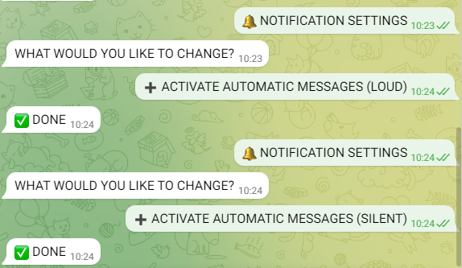

# Troubleshooting Guide

<hr>

- [Troubleshooting Guide](#troubleshooting-guide)
  - [The bot cannot be started](#the-bot-cannot-be-started)
    - [Bot not started / hung up](#bot-not-started--hung-up)
    - [Faulty program start](#faulty-program-start)
    - [API Key not stored correctly](#api-key-not-stored-correctly)
  - [No notifications are sent](#no-notifications-are-sent)
    - [Notifications disabled](#notifications-disabled)
    - [Notification rule incorrect](#notification-rule-incorrect)
    - [Notifications stuck in queue](#notifications-stuck-in-queue)
  - [The bot does not respond to any requests](#the-bot-does-not-respond-to-any-requests)
    - [Not authenticated](#not-authenticated)
    - [Bot not started](#bot-not-started)
  - [Should none of the above lead to a solution](#should-none-of-the-above-lead-to-a-solution)

<hr>

## The bot cannot be started
To even recognise whether the bot has been started or not, try writing `/start` to the bot. If he does not answer you, he is effectively not online.

### Bot not started / hung up
It is possible that the service has not been started. Try the following command to start the bot:

```bash
omd_site_name=<omd_site_name> # CHANGE <omd_site_name> to the name of your OMD site
systemctl restart checkmk-telegram-plus-$omd_site_name.service
```

Should this not work there is also the possibility that the bot has hung up for some reason. In this case, try to do the following:

```bash
omd_site_name=<omd_site_name> # CHANGE <omd_site_name> to the name of your OMD site
systemctl restart checkmk-telegram-plus-$omd_site_name.service
```

To check that the bot has been started successfully, execute the following command.

```bash
systemctl status checkmk-telegram-plus-$omd_site_name.service
```

You should get an output like the following example. It is important that the service is **active (running)**. If this is not the case, go to: The bot cannot be started.

```bash
● checkmk-telegram-plus-monitoring.service - CheckMK Telegram Plus Service
     Loaded: loaded (/etc/systemd/system/checkmk-telegram-plus-monitoring.service; enabled; vendor preset: enabled)
     Active: active (running) since Thu 2023-07-27 15:02:48 CEST; 3 days ago
    Process: 32319 ExecStartPre=/bin/sleep 60 (code=exited, status=0/SUCCESS)
   Main PID: 34339 (runuser)
      Tasks: 0 (limit: 9508)
     Memory: 716.0K
        CPU: 6ms
     CGroup: /system.slice/checkmk-telegram-plus-monitoring.service
     ...
```

### Faulty program start
If the bot cannot be started, stop the service as explained below and start the script manually using the OMD user. In case of a possible program bug, you should receive an output that explains in more detail why the bot cannot be started.

```bash
omd_site_name=<omd_site_name> # CHANGE <omd_site_name> to the name of your OMD site
systemctl stop checkmk-telegram-plus-$omd_site_name.service

su - $omd_site_name
cd local/share/checkmk-telegram-plus
python3 telegram_bot.py
```

If you cannot find a potential error source / solution from the output, follow the further steps. If these steps do not help either, create an issue here on github with the respective outputs.

### API Key not stored correctly
If you enter the wrong API key during installation, the bot will not start because you cannot authenticate yourself to Telegram. To check whether the API key was specified correctly during installation, execute the following command on the server.

```bash
omd_site_name=<omd_site_name> # CHANGE <omd_site_name> to the name of your OMD site
cat /opt/omd/sites/$omd_site_name/local/share/checkmk-telegram-plus/config.ini | grep api_token
```

Compare the output with the key you received from the Bot Father. If it is not the same, uninstall and install the bot. The uninstallation is necessary because, for safety reasons, the API key is only set during the first installation.

## No notifications are sent

### Notifications disabled
The first possible error may be that you have not activated the respective notifications. Check if you have the notifications active. To do this, first open the notification settings in Telegram Bot.
<br>

Once you have opened it, **it should NOT look like the picture below**! If it looks like the following picture, **you have deactivated the notifications**! Activate both or the one that is deactivated.
<br>
<br>

### Notification rule incorrect

It is also possible that you have created the notification rule incorrectly or not at all. Check that it has been created exactly as shown in the following illustration. (How to create such a notification rule can be found in the installation guide).
<br>

### Notifications stuck in queue

The notification could also get stuck in the queue. To check that the bot delivers all messages that CheckMK sends to it, execute the `🔔 LIST NOTIFY QUEUE` function in the CheckMK Telegram bot. You should receive `🚫 EMPTY` as a response. If you do not receive `🚫 EMPTY` as a response, execute the command several times to make sure that a notification was not attempted to be delivered at that exact moment.

If after several checks the bot still returns something instead of `🚫 EMPTY`, try restarting the service. Execute the following command as superuser (root) on the server

```bash
omd_site_name=<omd_site_name> # CHANGE <omd_site_name> to the name of your OMD site
systemctl restart checkmk-telegram-plus-$omd_site_name.service
```

If the problem persists, create an issue here on Github and I will help you.

## The bot does not respond to any requests

### Not authenticated

The first potential problem is that you are not authenticated to the bot. Try writing /authenticate to the bot. If it responds to you, write it the password you have defined at the installation. You should get a response where the bot tells you that the authentication process was successful.
<br>

### Bot not started

If the bot does not respond to /authenticate, the bot may have been stopped. To start the bot, try to execute the following command on the server as superuser (root):

```bash
omd_site_name=<omd_site_name> # CHANGE <omd_site_name> to the name of your OMD site
systemctl start checkmk-telegram-plus-$omd_site_name.service
```

To check that the bot has been started successfully, execute the following command on the server:

```bash
systemctl status checkmk-telegram-plus-$omd_site_name.service
```

You should get an output like the following example. It is important that the service is **active (running)**. If this is not the case, go to: The bot cannot be started.

```bash
● checkmk-telegram-plus-monitoring.service - CheckMK Telegram Plus Service
     Loaded: loaded (/etc/systemd/system/checkmk-telegram-plus-monitoring.service; enabled; vendor preset: enabled)
     Active: active (running) since Thu 2023-07-27 15:02:48 CEST; 3 days ago
    Process: 32319 ExecStartPre=/bin/sleep 60 (code=exited, status=0/SUCCESS)
   Main PID: 34339 (runuser)
      Tasks: 0 (limit: 9508)
     Memory: 716.0K
        CPU: 6ms
     CGroup: /system.slice/checkmk-telegram-plus-monitoring.service
     ...
```

## Should none of the above lead to a solution
If you still do not have a solution to your problem, try (if you have not already tried) to uninstall the bot completely and install it again. If this still doesn't solve your problem, you can create an issue for your problem here on Github and I will help you.
